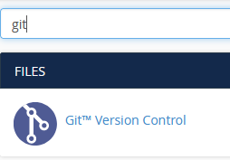
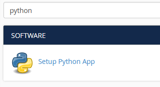
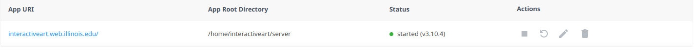
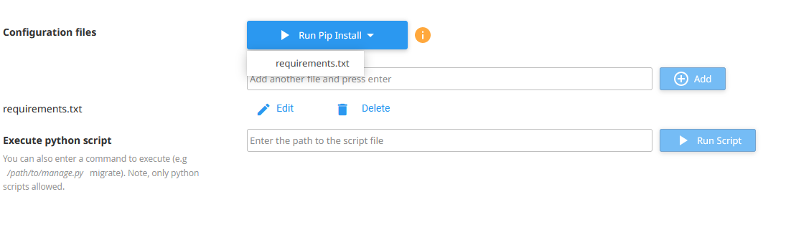
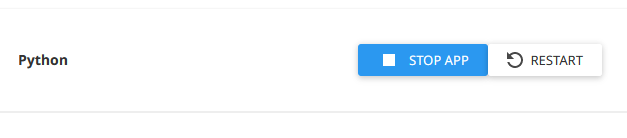

# cPanel Deployment

## Pulling Changes from `main`
- Go to Git version control from the interactiveart dashboard
    
    
- Click `Manage` for the interactive-art repo

    
- Click the `Pull or Deploy` tab
- Click `Update from Remote` 
- Finally click `Deploy HEAD Commit`
    - This follows the commands in the `.cpanel.yml` file, which just copies the files from the repo to its appropriate place and restarts the server

## Installing New Python Packages
If any new python packages were installed take the following steps
- Go to the python app

    
- Click the edit symbol

    
- Click `Run Pip Install` for `requirements.txt`

    
- Finally click `Restart`

    